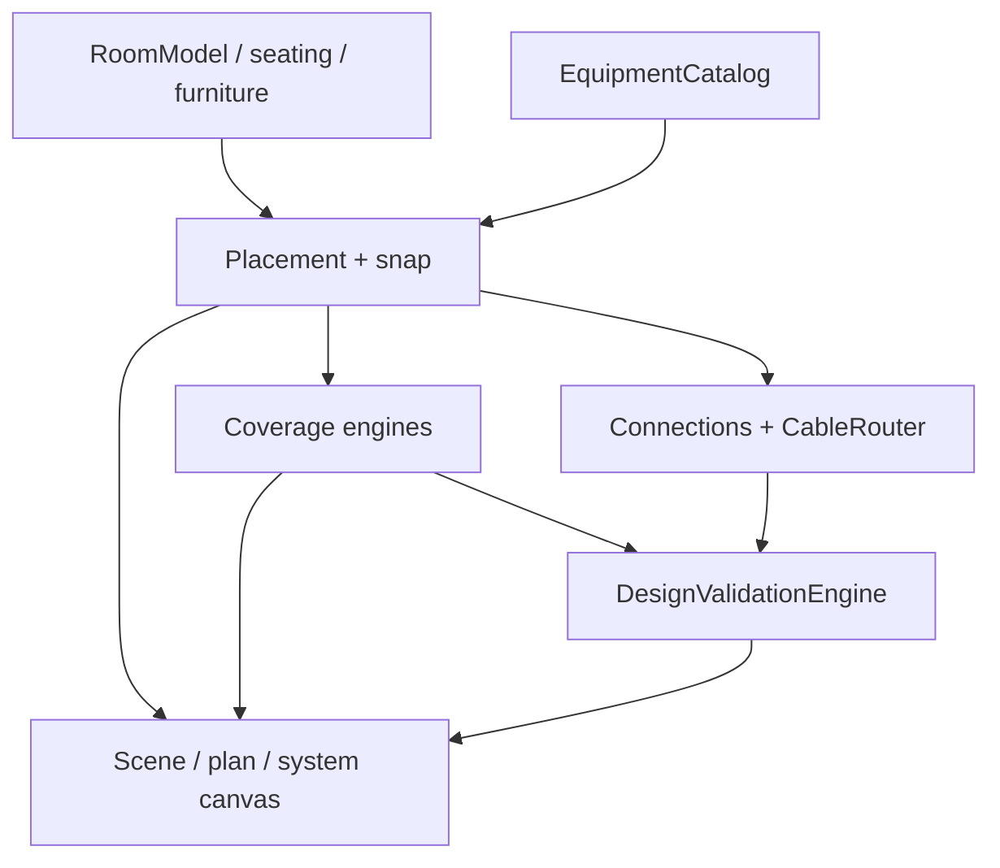

# AV System Engineering Simulator

3D engineering tool for **AV system design**: room geometry, equipment placement, rack planning, geometric coverage *estimates*, sightline/viewing checks, signal-path connectivity, cable routing, and rule-based design validation.

This is **engineering software** (spatial modelling + catalogs + design rules), not a Three.js demo and not a physics-level acoustic or lighting simulator.

Live build: [custom-3-d-simulator-for-av-system.vercel.app](https://custom-3-d-simulator-for-av-system.vercel.app)

---

## Problem

AV rooms are designed under constraints that are easy to miss in a 2D drawing:

- Can every seat see the display (distance, angle, obstruction)?
- Does camera FOV cover the talker positions you care about?
- Are loudspeakers and microphones aimed where people actually sit?
- Do ports, cable types, and rack RU allocations form a coherent system?
- What length and type of cable does the design imply for a BOQ?

The tool encodes those questions as **geometry + catalogs + validation rules** so a designer can iterate in 3D and get a structured finding list instead of an unmarked render.

---

## What it does vs what it does not

| It does | It does not |
| --- | --- |
| Place rooms, furniture, displays, cameras, mics, speakers, racks | Predict reverberation, STI, or phase interference |
| Geometric speaker coverage (catalog dispersion + inverse-square SPL *estimate*) | Replace EASE / Bose Modeler / acoustic FEM |
| Camera frustum / FOV coverage *estimate* | Optical lens design or sensor SNR |
| Display viewing distance/angle and sightline obstruction | Human-factors certification |
| Obstacle-aware polyline cable routes and length totals | BIM cable trays or NEC ampacity |
| Port compatibility and system completeness checks | Full SPICE / SI / EMI analysis |
| Catalog-driven equipment and BOQ-oriented cable summaries | Automatic purchasing or live inventory |

Coverage engines are labelled as **engineering estimates**. Missing catalog data is treated as incomplete - the code does not invent 90-degree dispersion or 100 dB SPL.

---

## Architecture

```text
Room geometry + seating
        ->
Equipment catalog + instances (3D placement, racks)
        ->
Coverage / viewing / sightline engines  (geometric estimates)
        ->
System graph (ports, connections, cable routes)
        ->
Validation registry (errors / warnings / notes)
        ->
UI: 3D scene, plan, elevation, system canvas, findings
```



### Source map (what to open first)

| Area | Path |
| --- | --- |
| Room / seating | `src/room/` |
| Catalog | `src/catalog/` |
| Display / camera / speaker / mic estimates | `src/av/*CoverageEngine.ts`, `src/av/DesignAnalysis.ts` |
| Heatmap / floor sampling | `src/av/HeatmapEngine.ts`, `src/av/simulation/` |
| Cables / ports / BOQ lengths | `src/system/` |
| Rule-based findings | `src/av/validation/` |
| Auto-layout pipeline | `src/autodesign/` |
| 3D / overlays | `src/engine/` |
| UI | `src/ui/` |

The Design Assistant panel is a **checklist over existing engines** (inventory, coverage summaries, validation findings). It is not a generative AI model.

---

## Engineering decisions

- **Catalog is source of truth.** Coverage uses manufacturer-style fields (`maxSplAt1m`, dispersion, FOV) when present; otherwise the result is incomplete, not guessed.
- **Validation does not duplicate math.** `DesignValidationEngine` consumes viewing, sightline, furniture, rack, cable, and system checks already implemented elsewhere.
- **Cables are polylines.** Length is the sum of segments around obstacles, not a single Euclidean hop through a table.
- **Undo vs analysis.** Validation reports are derived state; they are not stuffed into undo snapshots.
- **TypeScript + tests.** Rule and routing behaviour is covered with Vitest (`tests/`).

---

## Stack

TypeScript | Three.js | Vite | Vitest

No backend. No environment variables. Static deploy (`dist/`).

---

## Run / test

```bash
npm install
npm run dev
```

```bash
npm run test
npm run build
```

Vercel: build `npm run build`, output `dist`.

---

## Status and limits

Active development. Geometric coverage, heatmaps, and cable paths are **design aids**. They are not a substitute for acoustic commissioning, camera commissioning, or a licensed electrical design.

---

## License

No license file in this repository yet. Treat as source-available for portfolio review unless a license is added.

---

### Managed By: 
Abishek Budihal
